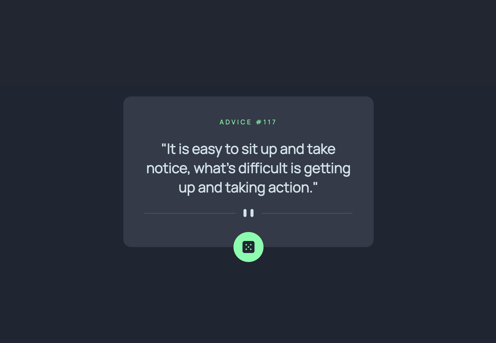

# Frontend Mentor - Advice generator app solution

This is a solution to the [Advice generator app challenge on Frontend Mentor](https://www.frontendmentor.io/challenges/advice-generator-app-QdUG-13db). Frontend Mentor challenges help you improve your coding skills by building realistic projects.

## Table of contents

- [Frontend Mentor - Advice generator app solution](#frontend-mentor---advice-generator-app-solution)
  - [Table of contents](#table-of-contents)
  - [Overview](#overview)
    - [The challenge](#the-challenge)
    - [Screenshot](#screenshot)
    - [Links](#links)
  - [My process](#my-process)
    - [Built with](#built-with)
    - [What I learned](#what-i-learned)
    - [Useful resources](#useful-resources)
  - [Author](#author)

## Overview

My first challenge in Frontend Mentor.

### The challenge

Users should be able to:

- View the optimal layout for the app depending on their device's screen size
- See hover states for all interactive elements on the page
- Generate a new piece of advice by clicking the dice icon

### Screenshot



### Links

- [Github repository](https://github.com/lipe11/advice-generator-app)
- [Live app](https://lipe11.github.io/advice-generator-app/)

## My process

### Built with

- **CSS Grid** to handle the positioning of the advice box and the footer.
- **flexbox** to arrange the elements within the advice box.
- **petite-vue** to handle data fetching and data binding (initially I made this with Vue.js, but thinking it might be a bit overkill, thought it was a good oportunity to try petite-vue).

### What I learned

The dice button design was a good oportunity to try relative positioning within a flexbox container and learning about box shadow.

```css
.advice-box {
  display: flex;
  flex-direction: column;
}

.advice-box__button {
  align-self: center;
  height: 60px;
  width: 60px;
  position: relative;
  top: 30px;
  /* other stuff */
}

.advice-box__button:hover {
  box-shadow: 0 0 20px 10px hsl(150, 100%, 66%, 0.3);
}
```

The divider design and SVGs was a weird situation that made me think more on how to think responsive. In this case, I aproximated `min-width` of the media query based on the width of the mobile SVG, and the result I think was pretty smooth.

```css
@media (min-width: 420px) {
  .advice-box__divider {
    background-image: url('images/pattern-divider-desktop.svg');
  }
}
```

### Useful resources

- [Fireship - Vue.js Explained in 100 Seconds](https://www.youtube.com/watch?v=nhBVL41-_Cw)
- [BEM - CSS Naming Conventions](http://getbem.com/naming/)

## Author

- Frontend Mentor - [@lipe11](https://www.frontendmentor.io/profile/lipe11)
